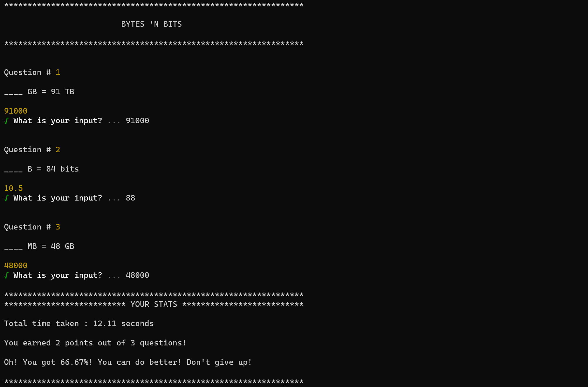

# BytesNbits Game

*BytesNbits* is a unit conversion game that checks to see how fast you can convert your bites, B, KB, MB, GB, and TB!

## Rules to the Game:
- You would enter the number of randomly generated questions you would like to answer. 
- Once you press 'Enter' a timer will start! 
- The integer and the unit to the question are randomly generated as well as the unit to the question.
- At the end of your game, your stats will be displayed containing the amount of time the game took, the number of points earned, and a response based on your score!

Example #1: Getting 2 out of 3 questions correct

Example #2: Getting 3 out of 3 questions correct

Are you ready to test your Bites, B, KB, MB, GB, and TB? Ready, set, GOOOO!!!!!!  🥉 🤗